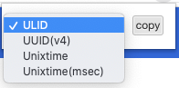

# Quick Copy - IDなどをサクッとコピー

[chrome ウェブストア - Quick Copy - IDなどをサクッとコピー](https://chrome.google.com/webstore/detail/quick-copy-id%E3%81%AA%E3%81%A9%E3%82%92%E3%82%B5%E3%82%AF%E3%83%83%E3%81%A8%E3%82%B3%E3%83%94%E3%83%BC/cniakcmcdofhdajoenifbknmfhacglnj)

各種IDやUnixtimeなどを手軽に素早くコピーする拡張機能です。

コピーできるのは、
- ULID
- UUID(v4)
- Unixtime
- Unixtime(msec) ※１
  となります。

これまでコマンドを実行して生成したり、ツールを利用して生成していた作業をショートカット※２とEnterで素早くコピーすることができるようになります。

※１：Unixtimeのミリ秒  
※２：Macの場合：Command+Shift+Y、その他OSの場合：Ctrl+Shift+Y

## 使い方

アイコンをクリックしてポップアップを表示して、コピー対象を選択肢、`copy`ボタンをクリックまたは`Enter`を入力でクリップボードにコピーされます。  

### ショートカットを利用

- `Command+Shift+Y`(または`Ctrl+Shift+Y`)でポップアップを表示
  - コピー対象を選択(`Option+↓`または`Alt+↓`)
- `Enter`でコピー
